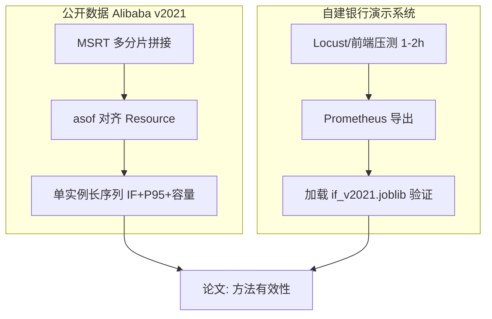

# 长序列 / 更大数据量 — 硕士论文实验方案

针对当前现象（宽表 2k 行、单实例仅 5 点、分片 1/2 为空）的根因与对策。

---

## 一、问题根因（必读）

| 现象 | 原因 |
|------|------|
| 只有约 29 分钟数据 | 每个 **MSRTQps_N** 分片仅覆盖约 **29min**（12h÷25）；只跑 `_0` 就只有一段 |
| shard_1/2 行数为 0 | ① `MSRT_NROWS` 截断，读不到后面的 msname；② 该 msname 在该时间窗无调用；③ CSV 未下载/为空 |
| 单实例只有 5 个点 | **inner merge** 要求 timestamp 完全一致；MSRT **30s**、Resource **60s**，对齐后极稀疏 |
| 多分片没拉长 | Resource/MSRT 分片 **粒度不同**（12 vs 25），需 **分别拼 MSRT 与 Resource** 再合并 |

---

## 二、推荐目标（论文口径）

| 档位 | MSRT 分片 | MSResource 分片 | 约 trace 时长 | 单实例期望点数（asof） |
|------|-----------|-----------------|---------------|------------------------|
| **最低可写** | 0,1,2,3 | 0,1 | ~2h | 60～120+ |
| **推荐** | 0～7 | 0～3 | ~4h | 120～240+ |
| **充裕** | 0～11 | 0～5 | ~6h | 200+ |
| **演示系统主验证** | — | — | 压测 1～2h Prometheus | 与训练口径一致即可 |

公开数据 **不必跑满 12h**；硕士论文 = **方法 + 足够长的单实例序列 + 自建系统验证**。

---

## 三、数据准备清单

### 1. 下载（配对分片号）

目录示例：`E:\data\alibaba-v2021\`

```
MSRTQps_0.csv … MSRTQps_7.csv      # 约 4h
MSResource_0.csv … MSResource_3.csv  # 覆盖对应资源窗（约 4h）
```

官方 wget 模板：

`http://aliopentrace.oss-cn-beijing.aliyuncs.com/v2021MicroservicesTraces/MSRTQps/MSRTQps_N.tar.gz`  
`http://aliopentrace.oss-cn-beijing.aliyuncs.com/v2021MicroservicesTraces/MSResource/MSResource_N.tar.gz`

### 2. 禁止截断（正式实验）

`.env` 中 **删除或注释**：

```env
# MSRT_NROWS=500000
# MS_RESOURCE_NROWS=2000000
```

### 3. 固定 anchor（跑完 shard 0 后）

从 `OUTPUT_DIR_V2021/shard_anchor.json` 复制到 `.env`：

```env
MSNAME_FILTER=...
MSINSTANCEID_FILTER=...
```

避免后续分片误选其他「调用量最大」服务。

---

## 四、`.env` 最长窗（约 12h，同一 msname）

需本地已解压 **全部** `MSRTQps_0.csv`～`MSRTQps_24.csv` 与 `MSResource_0.csv`～`MSResource_11.csv`（约 35GB+ 解压后，磁盘请预留充足）。

```env
OUTPUT_DIR_V2021=E:/output/v2021_full12h
V2021_MSRT_SHARDS=max
V2021_MS_RESOURCE_SHARDS=max
MERGE_STRATEGY=asof
# 不要 MSRT_NROWS / MS_RESOURCE_NROWS
```

```powershell
python -m bank_analytics v2021-diagnose
python -m bank_analytics v2021-shards
```

`max` 等价于 MSRT `0,1,...,24`、Resource `0,1,...,11`。建议在 **Kaggle 16GB+** 或本机 16GB+ 内存运行，耗时可能 **数小时**。

---

## 五、`.env` 推荐配置（约 2～4 小时窗，省资源）

```env
DATA_DIR_V2021=E:/data/alibaba-v2021
OUTPUT_DIR_V2021=E:/output/v2021_long

# 约 2h：MSRT 4 片；Resource 2 片
V2021_MSRT_SHARDS=0,1,2,3
V2021_MS_RESOURCE_SHARDS=0,1
# 或未分开设置时：
# V2021_SHARDS=0,1,2,3

# 缓解 30s/60s 采样不一致（默认 asof）
MERGE_STRATEGY=asof
MERGE_ASOF_TOLERANCE_MS=45000

ONLY_FIRST_MSNAME=true
# MSNAME_FILTER=...
# MSINSTANCEID_FILTER=...

# 不要 MSRT_NROWS / MS_RESOURCE_NROWS
```

---

## 六、执行顺序

```powershell
cd F:\bank-observability-demo\analytics

# 1) 诊断：各分片是否含 anchor msname
python -m bank_analytics v2021-diagnose

# 2) 长序列 merge + IF + 容量
python -m bank_analytics v2021-shards --msrt-shards 0,1,2,3 --resource-shards 0,1
```

### 成功标准（看日志）

```
拼接后 wide=XXXX 行, resource=YYYY 行
merge_asof(...) shape = ...
代表实例序列: N 行, trace 时间戳 [...] ms, 约 MM 分钟
```

- **N ≥ 100**（最低）；推荐 **N ≥ 200**
- **MM ≥ 90**（1.5h+）；推荐 **MM ≥ 120**

---

## 七、论文实验结构（建议）



| 章节 | 内容 |
|------|------|
| 数据 | 说明分片、抽样、asof 对齐；附 `shard_anchor.json` |
| 主结果 | 演示系统三类异常 + 容量触线 |
| 补充 | 公开 trace 长序列 IF 告警率 / 系数 αβγδ |
| 限制 | 未全量 12h、单 msname 代表实例 |

---

## 八、本地内存不够怎么办？

**不必把 25+12 个 CSV 同时放进内存。** 流水线本来就是 **逐片读 → 只保留一个 msname → 处理完再下一片**。

### 内存主要耗在哪？

| 阶段 | 峰值 |
|------|------|
| 读 **单片** `MSRTQps_N.csv` | often **数 GB**（整片载入） |
| 该片 `pivot` | 再占一份 |
| 拼完全部分片 | 所有 wide 若在内存里会叠加 → 已用 **`DISK_ACCUMULATE=true`**（默认）缓解 |

### 推荐做法（按优先级）

1. **`.env` 保持 `DISK_ACCUMULATE=true`**（已默认）  
   每片结果写到 `OUTPUT_DIR/_wide_parts/`、`_resource_parts/`，最后 **每 4 片一批** 读 parquet 拼接。

2. **磁盘可以大、内存小**  
   CSV 放机械盘/外置盘即可；**不必** 25 个 CSV 都拷到内存盘。缺的是 **RAM**，不是磁盘同时挂载数。

3. **分档拉长时间窗（不一次 max）**  
   ```env
   V2021_MSRT_SHARDS=0,1,2,3,4,5,6,7
   V2021_MS_RESOURCE_SHARDS=0,1,2,3
   ```  
   约 4h，8GB 机器往往可跑；论文常够用。

4. **云端跑 merge，本地只训模型**  
   Kaggle 16GB：见 `云端运行v2021指南.md`；下载 `merged_v2021_multishard.parquet` + `if_v2021.joblib` 即可。

5. **不要用 `MSRT_NROWS` 换内存**（长序列实验）  
   会截断 CSV，导致分片 1+ **msname 行数为 0**。

6. **仍 OOM**  
   - 关掉其它程序，只跑 `v2021-shards`  
   - 或改为 `V2021_MSRT_SHARDS=0,1,2,3` 先出结果，再逐步加分片  

### 分档跑两轮（无云、内存极小）

第一轮：`V2021_MSRT_SHARDS=0,1,2,3`，得到 `shard_anchor.json` → 写入 `MSNAME_FILTER`。  
第二轮：改 `OUTPUT_DIR` 为 `v2021_long_b`，`V2021_MSRT_SHARDS=4,5,6,7`，**需自行用 pandas 合并两次 multishard parquet**（或暂时只写论文 4h 窗）。

---

## 九、与旧命令的差异

| 项目 | 旧行为 | 新行为 |
|------|--------|--------|
| 分片 | MSRT_N 配 MSResource_N 同一循环 | **MSRT 与 Resource 分片列表可不同** |
| 合并 | 每片 inner merge 再拼 | **先拼 wide / resource，再一次 merge** |
| 对齐 | inner 同 timestamp | 默认 **merge_asof ±45s** |

---

## 十、仍不够时

1. 增加 MSRT 分片到 `0,1,…,7`  
2. 用 `MSNAME_FILTER` 换一个在多分片都活跃的 msname（看 diagnose 输出）  
3. **主实验放在 Prometheus 2h 导出**（与开题「短窗容量」一致）
